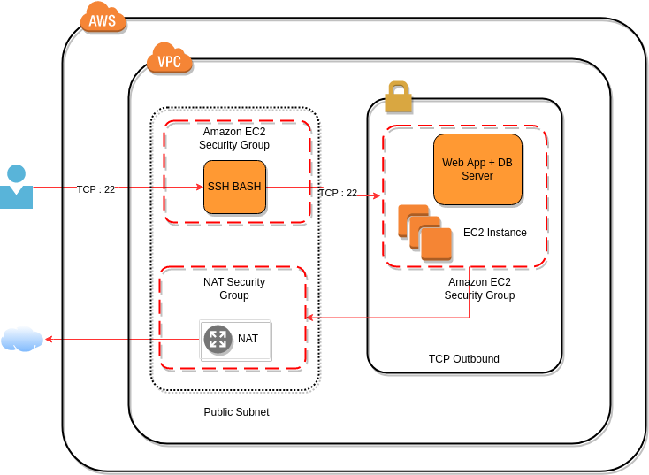

# Student_Reg_Form

## Cloud Computing Project
Student registration and admission management system of schools and colleges are getting automated and processed online. Here, cloud computing plays a major role in providing us the platform to host such applications. By comparing with the traditional system and looking at the particular we have seen that in the cloud computing method, network devices like firewalls, routers, and load-balancers for the applications no longer reside on physical devices and are replaced with software solutions. Multiple options are available to ensure quality software solutions. 
Our project aims at creating an ec2 server in AWS using Ansible and hosting a flask web application in it for students’ registration forms. The project automates the admission process making it more effective and efficient. It allows schools and colleges to manage the admission inquiries, track applicant status, centralize data management, build virtual systems and streamline the tedious admission process with ease.

### Tools & Technology 
- Flask: Flask is a web framework. This means flask provides you with tools, libraries, and technologies that allow you to build a web application.
- SQLite: SQLite is an in-process library that implements a self-contained, serverless, zero-configuration, transactional SQL database engine. It is a database, which is zero-configured, which means like other databases you do not need to configure it in your system.
- Ansible: It is a simple open-source IT engine that automates application deployment, intra-service orchestration, cloud provisioning, and many other IT tools.
- AWS EC2: An Amazon EC2 instance is a virtual server in Amazon's Elastic Compute Cloud (EC2) for running applications on the Amazon Web Services (AWS) infrastructure. 

### Work Flow :
- Create a EC2 Server
- Ansible to create script for ec2server
- Host reg form web app on ec2 

### Ansible playbook for EC2 Launch:

- task.yml is the ansible script here to create EC2 instance. 

    >**Ansible script note:**
    >
    >*Key_name: Go to EC2 dashboard -> Key pairs -> Create key pair -> Copy key pair name*
    >
    >*Instance_type: You can select the instance type whichever you want to launch.* 
    >
    >*Go to EC2 dashboard -> Launch instance -> Check instance type*
    >
    >*Image: Go to EC2 dashboard -> Launch instance -> ami id (Image id)*
    >
    >*Add  aws_access_key and aws_secret_key which we got from IAM user creation.*

- Run the below command to check whether Ansible is ready to launch EC2 or not.

> ansible-playbook -C task.yml

Where -C will check if everything is ready or not.
Now, run the below command and the EC2 server will be launched.

> ansible-playbook task.yml

- Now if you go to the Amazon console you will see the server is launched successfully.
We are done with creating a basic EC2 server using Ansible.

### Application on AWS Cloud:

#### Cloud Architecture:

We use the below command to get the local version of the repository from a remote:

> git clone https://github.com/tanya-ranjan2/Student_Reg_Form.git

Now our application repository with the code is on the EC2 instance. We will create a virtual environment and then all the required libraries are installed using the below command :

> cd Student_Reg_Form/FinalCRUDApplication

#### Create a virtual environment
> virtualenv venv 
#### Activate the virtual environment venv
> source venv/bin/activate
#### Install the libraries stored in requirement.txt

> pip3 install -r requirement.txt

Now we are ready to run the application and host it on AWS cloud, which is by the below command:

> python3 app.py

Through this, our application starts on AWS and we will now set some security groups on for the EC2 instance to get the public IP accessible from everywhere. 
As our flask application is using port 5000, we make a rule for port 5000 accessible from anywhere in the security group.

Using the public IP provided of our instance and the port where our app is hosted, we can use our application from anywhere which is http://54.90.96.229:5000/

--------------------------------------------------------------------------------------------------------------

*Run the script with **nohup** which ignores the hangup signal. This means that you can close the terminal without stopping the execution. Also, add **&** so the script runs in the background*

> nohup app.py &

You can find the process and its process Id with this command:

> ps ax | grep app.py

If you want to stop the execution, you can kill it with the kill command:

> kill PID

or

> pkill -f app.py

[Link to refer for nohup](https://janakiev.com/blog/python-background/)
